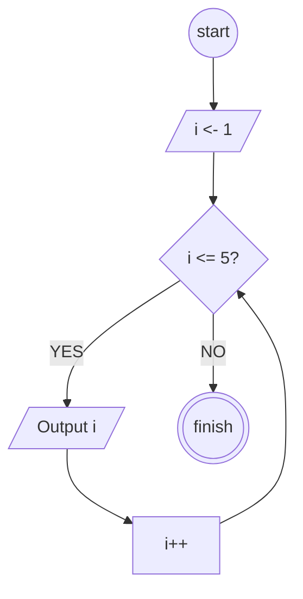

# Flowchart

```mermaid
flowchart TD
    start((start))
    init[/i <- 1/]
    check{i <= 5?}
    output[/Output i/]
    increment[i++]
    finish(((finish)))

    start --> init --> check
    check -- YES --> output --> increment --> check
    check -- NO --> finish
```
# Pseudo-Code
``` pseudo-code
FOR i <- 0 TO 5 STEP 1
    OUTPUT i
NEXT i
```